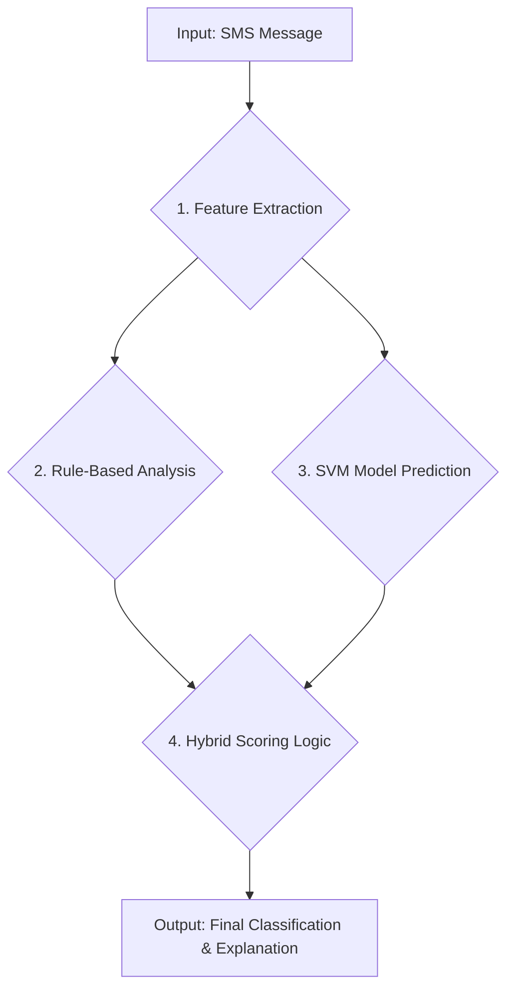

# ScamRadar — A Hybrid System for Scam Detection in Vietnamese Text

ScamRadar is a web-based tool for detecting and classifying scams in Vietnamese text. It uses a hybrid approach that combines a traditional Machine Learning model (SVM) with a high-priority rule-based engine to capture contextual signals that ML models sometimes miss.

---

## Live demo

Try the application on Hugging Face Spaces:
[ScamRadar on Hugging Face Spaces](https://huggingface.co/spaces/Senrade/scamradar)

Or try this live demo link instead (if you cannot access, it means the link has expired):
SScamRadaron live Gradio demo](https://a6710159ab3273af04.gradio.live/)

---

## Architecture

ScamRadar processes incoming SMS messages through a multi-layered pipeline that blends feature extraction, rule-based checks, and an SVM prediction to produce a final score and explanation.



### Pipeline components

* **Feature Extraction**
  Extracts binary and simple features from raw text (implemented with regular expressions). Examples: `has_url`, `has_phone`, `has_money`.

* **Rule-Based Analysis (high priority)**
  A set of deterministic business rules run before trusting the ML score. Rules are designed to catch high-confidence scam or safe patterns that the SVM might misclassify.

  Important rule types:

  * **Brand impersonation** — message contains a trusted brand name (e.g., Viettel, BIDV) but links to an unofficial/mismatched domain. *(Highest priority — overrides ML.)*
  * **Authority impersonation** — contains official keywords (e.g., government, Ministry of Public Security) together with risky call-to-actions (URL or phone number).
  * **Verified communications** — matches brand names to known official domains or recognizes safe announcements (e.g., government public service announcements that include no risky actions).

* **SVM Model Prediction**
  A pre-trained Support Vector Machine (SVM) model packaged as a `joblib`-serialized pipeline. The pipeline uses a `ColumnTransformer` with `TfidfVectorizer` to produce a baseline scam probability.

* **Hybrid Scoring & Final Classification**
  The final classification combines rule outputs and the SVM probability:

  * If a high-priority rule triggers (e.g., impersonation), the system **overrides** the SVM probability and assigns a very high scam score.
  * If a rule marks a message as safe, the SVM score is **significantly reduced**.
  * If no rules apply, classification relies on SVM probability thresholds (example thresholds):

    * `> 0.85` → **⚠️ High risk**
    * `> 0.65` → **🤔 Suspicious**
    * `<= 0.65` → **✅ Likely safe**

---

## Tech Stack

- **ML & NLP:** scikit-learn, PyVi, Tfidf/Count Vectorizer  
- **Data:** pandas, regex  
- **Visualization:** matplotlib, seaborn  
- **Model Handling:** joblib  
- **UI & Deployment:** Gradio  

---

## Project structure

```
.
├── models/
│   └── svm_pipeline.pkl    # The pretrained ML model
├── app.py                  # Main Gradio application logic
├── requirements.txt        # Python dependencies
└── README.md               # You are here
```

---

## Local setup & installation

1. **Clone the repository**

```bash
git clone https://github.com/your-username/your-repo-name.git
cd your-repo-name
```

2. **Create and activate a virtual environment (recommended)**

```bash
python -m venv venv

# On Windows:
venv\Scripts\activate

# On macOS / Linux:
source venv/bin/activate
```

3. **Install dependencies**

```bash
pip install -r requirements.txt
```

4. **Run the Gradio application**

```bash
python app.py
```

The app should be available at a local URL (e.g., `http://127.0.0.1:7860`) shown in the console.

---

## Model & implementation notes

* The SVM model is trained within a `ColumnTransformer` pipeline that includes a `TfidfVectorizer`. The pipeline is serialized to `models/svm_pipeline.pkl` via `joblib`.
* Regex-based feature extraction is used to derive simple boolean features such as `has_url`, `has_phone`, and `has_money`. These features are combined with the TF-IDF text features as input to the SVM pipeline.
* Business rules are prioritized higher than the ML score for safety-critical patterns (brand or authority impersonation).

---

## Future improvements

Potential enhancements to increase detection coverage and maintainability:

- **Feature Engineering**: move to deep learning (e.g., PhoBERT) for better context understanding and fewer misclassifications.  
- **External Services**: integrate **VirusTotal API** for URL reputation checks, extend explanations beyond rules.  
- **Model Maintenance**: set up a **CI/CD pipeline** for continuous retraining, using both collected data and user feedback.  
- **Feedback Loop**: allow everyday Vietnamese users and researchers to submit raw reports with labels for later review.  
- **Scalability & Vision**: remain a research/demo tool, but may expand to other Vietnamese text sources (email, forums, URLs). Focus stays on Vietnamese only.

---

## Notes & Acknowledgements

- **Project Purpose**: ScamRadar is built as a learning project and demo, not a production-ready system. Its main goal is to explore hybrid ML + rule-based approaches for Vietnamese scam detection.  
- **Methodology**: The system combines the flexibility of machine learning with the precision of deterministic rules to capture real-world context that models alone might miss.
- **For Future Extensions**: Anyone extending this project (e.g., adding new labels, languages, or moving toward production) should consider:
  - Unit tests for business rules  
  - Evaluation datasets with challenging edge cases  
  - Monitoring for data/model drift over time  

---
